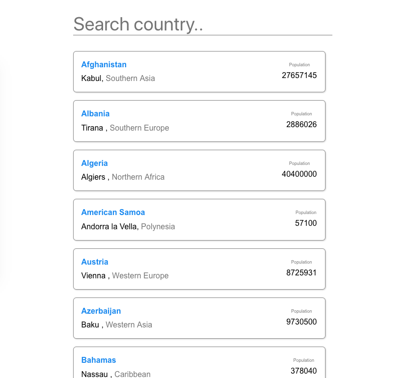

# Frontend angular coding exercise v.1.0.1

Goal is to create a single page Angular2+ application following the requirements listed below.

Feel free to use any CSS framework or styling method or add more libraries, if and as need.

## Requirements

- Scaffold the project
- Use Angular httpClient to fetch the list of countries from: [https://restcountries.eu/rest/v2/all][1]
- Display result on the page
- Provide a way to filter list by country name
- Provide tested source code for review

## Example

Below screenshot illustrates how the application could look like, but the final result is completely up to you.

## Result

The exercise should take around 2 days to complete. When finished, please [email][2] the source code or provide a link to your repository.

[1]: https://restcountries.eu/rest/v2/all
[2]: mailto:AllianzTechnology.TH-Career@allianz.com